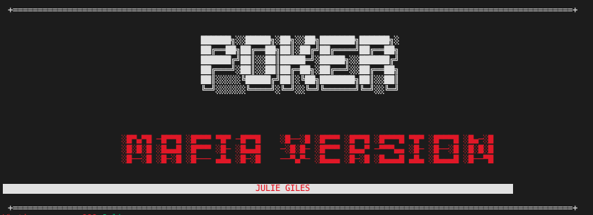
-------------------------
-------------------------
# Purpose & scope (R5)

The purpose of this application ('app') is to execute a poker game between a single player and the Dealer (computer) in the command line interface using the Ruby programming language and Ruby Gems. 

This app was made as an assessable assignment and the below codes starting with 'R' (eg R3-R13) refer to specific assignment criteria. 

### *Problem & solution*
As this game is between a single player and the computer, there is no point of having small blind and large blind (like in a normal poker game with usually more than 2 players). Instead of betting with money, the player bets by risking the loss of a (cartoon/virtual) finger (thus the mafia-style version of the standard poker game).

### *Target audience*
The target audience is anyone who enjoys a game of probability and game theory. Please note that there is a ASCII animation of a virtual, un-realistic cartoon finger being cut off if the player loses a round, so the application is not intended for children or anyone who may find this shocking.

### *How a target audience member uses the app*
The user interacts with the app by:
* entering their name, where prompted; 
* by selecting a pre-determined option using an arrow; and/or
* entering a value where indicated.

At each step of the game, the player can view their current cards and the cards which have been dealt on the table to decide if they want to keep playing. 

-------------------------
-------------------------

### *Link to source repository (R4)*
Assignment submission: https://github.com/juliejgiles/TerminalApp

-------------------------
-------------------------
# Features (R6)
### *1. Using class object and global variables to represent how a deck of cards operate in real life*
Used a Class object 'Card' to represent individual cards (with a given card value and suit) and then a global constant 'Deck' to store 52 instances of the Card objects. The global constant is shuffled at the time the app is loaded, and then does not change its values for the rest of the game. This way, the same card cannot be dealt twice in any given game. The first 9 cards are taken off the top of the 'Deck' and then used to play out each game (2 are dealt to the player, 2 are dealt to the Dealer and hidden until the end of the game, and 5 cards are put on the table). 

### *2. Poker combination detection and ranking*
The app combines the player's hand of 2 cards with the 5 dealt cards on the table into a new array and look for Poker combinations such as:
* Royal flush (where there are 5 card values being A,K,Q,J,10 all of the same suit)
* Strait flush (five cards in a row, all of the same suit)
* Four of a kind (four cards of the same card number)
* Full house (three of a kind and two of a kind, can be any suit)
* Flush (five cards of the same suit, can be different card numbers)
* Straight (five cards in sequence, can be different suits) 
* Three of a kind (three cards of the same card number)
* Two pair (two sets of two cards of the same card number)
* Pair (one set of two cards of the same card number)

A rank is assigned to the player's hand based on what they have, and this is compared with the Dealer's hand and Dealer's rank, to determine a winner.

### *3. Visual representation of cards in Command Line Interface*

The app uses ASCII symbols in the command line interface to represent each card, using String Literals in ruby to insert the value of a card into the visual representation. 

When the Dealer deals the flop (3 cards on the table), the other 2 cards ('Turn' and 'River') are face down and hidden from view. This gives the player a chance to decide whether to fold or to keep playing as at this point in time, they can see their 2 cards and the flop and can make a decision about whether to continue playing. The values of the face-down cards do not change between when they are dealt face down or when they are turned upwards. 

### *4. Error handling*
Error messages are notified to the players if an invalid input is detected by raising an ArgumentError. For instance, where the user does not enter a value when selecting whether to check or fold their cards, or where they enter a option that is not one of the available options. 

-------------------------
-------------------------
# User Interaction (R7)

When the app is run, the player sees the title of the game, and a question asking them for their name. The player is able to enter there name, which is stored as a global constant and at the end of the game, their name, the time that they played and the outcome of the game is saved into a file. 

The player then sees a menu displaying three options:
* read the rules of the game 
* play
* quit game 

If the player chooses to read the rules of the game, the rules will be displayed and the player will be taken back to these choices again.

If the player chooses to play, then the dealer will deal 2 cards to the player. The player can then choose to fold, 'check' (keep playing) or quit the game. 

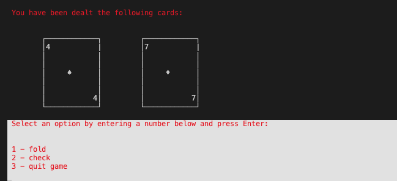

If the player 'checks', then the dealer deals the Flop (which is 3 cards faced up on the table), and 2 cards faced down. 

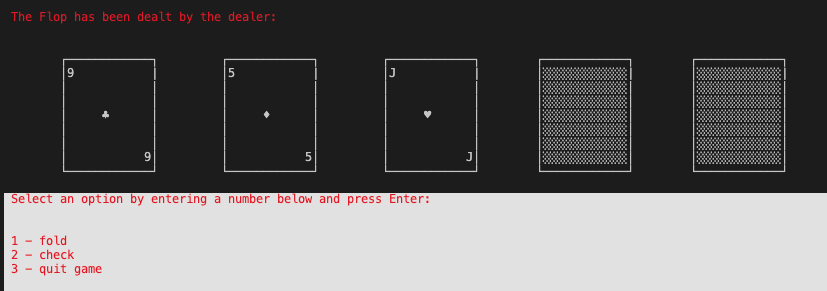

The player is asked again whether they want to keep playing, fold or quit the game. If the player continues to play, then the 2 face down cards are revealed (the 'Turn' and 'River' cards). 

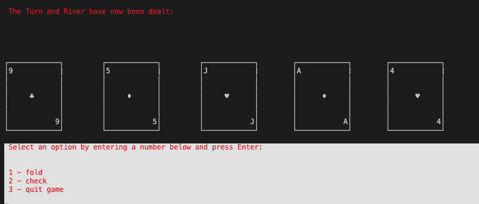

At this point in time, the player can compare their own hand to the 5 cards on the table to see if they have any winning combinations. However, they cannot see the Dealer's hand (of 2 cards) so they have to estimate their  probability of winning the game. 

The player has a choice to keep playing or fold or quit. If the player keeps playing, then the Dealer's cards are revealed. The player's cards are also displayed again.

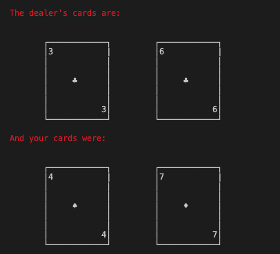

The player's hand consists of 7 cards (their 2 plus the 5 on the table), and the game determines what the highest 5-card combination is out of the 7 cards. The same process is carried out for the dealer's hand (which is made up of their 2 cards plus the 5 cards on the table). 

The app then announces who the winner of the game is. At the end of the game, the game history is displayed to show previous players, when they played and the outcome of their game. 

A losing scenario looks like the following (finger animation not shown here):

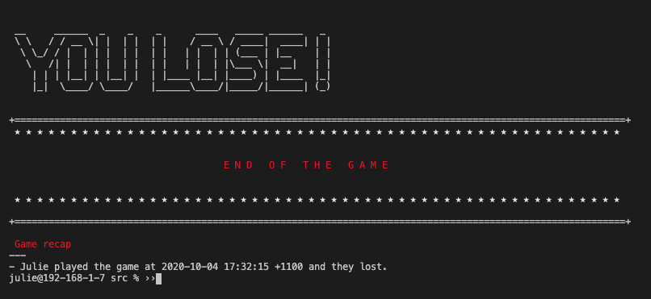

A winning scenario looks like the following:
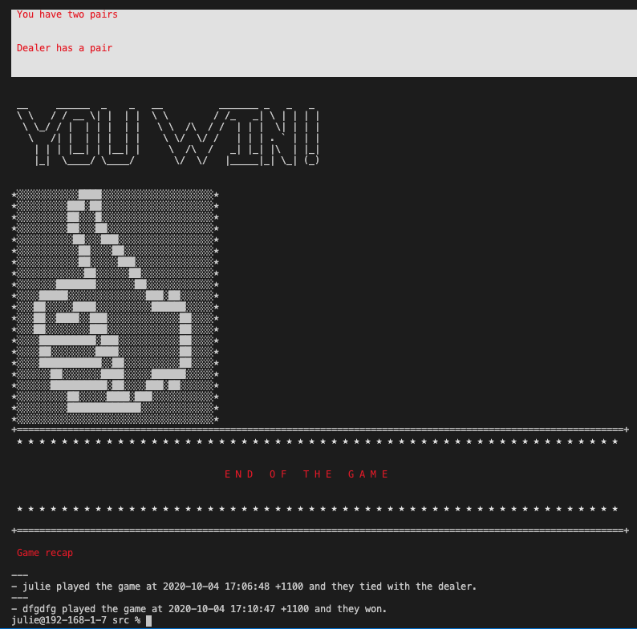

A tied scenario looks like the following: 

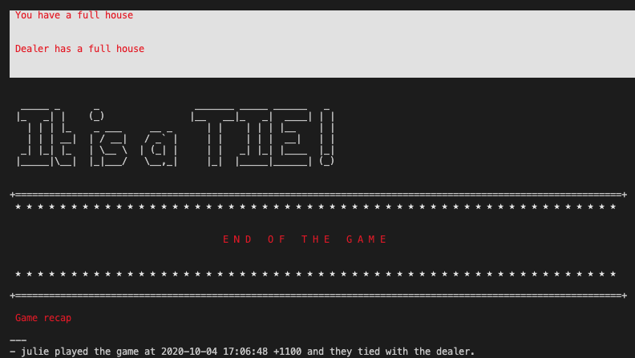

### *Error Handling*

If the player selects an option that's not one of the listed available options, an ArgumentError is raised and a custom message is outputted to them to try again. Eg, when they press enter without inputting a value, or when the value is not in the intended range.

-------------------------
-------------------------
# Control Flow Diagram (R8)
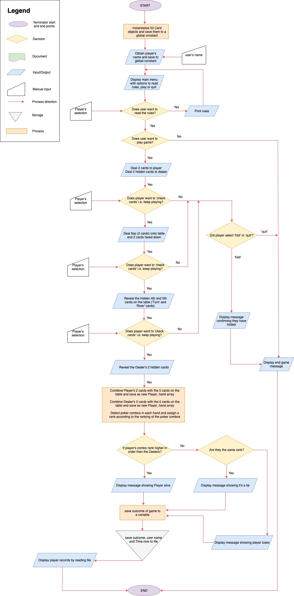

-------------------------
-------------------------
# Implementation Plan & Project Management (R9, R13)

A Trello board was used to implement this application at https://trello.com/b/JRwSx1Dn/pokermafiaversion

-------------------------
-------------------------
# Installation (R10)
*Steps to install application & dependencies*

* the application can be downloaded from my github page at https://github.com/juliejgiles/TerminalApp 
* the application requires Ruby Gems such as Colorize, TTY-Prompt, Ruby2d, Artii, RSpec and others. In the application directory in the command line interface, run `bundle install` to install the Ruby Gem dependencies for this application.
* Next, run `./run_app.sh` to execute application.

*System/hardware requirements*
* Ruby must be installed on your system to run this application
* minimum requirements to run a command line interface application

-------------------------
-------------------------
# Command Line Arguments

The below command line arguments can be used:
* -h 
* --help

-------------------------
-------------------------
# Tech/framework/Gems used
* Ruby programming language
* TTY-prompt Gem, https://rubygems.org/gems/tty-prompt
* Colorize Gem, https://rubygems.org/gems/colorize 
* Ruby2d Gem, https://rubygems.org/gems/ruby2d
* Artii Gem, https://rubygems.org/gems/artii

-------------------------
-------------------------
# Tests (R17)

There are 2 test files included in the spec/models/ directory to test:
* that a card cannot be drawn twice in the same game (5 test cases)
* the royal flush combination detection code works correctly (3 test cases)

Please see the comments in both test files for further information about how the tests are run.

Screenshot of first test passing: 
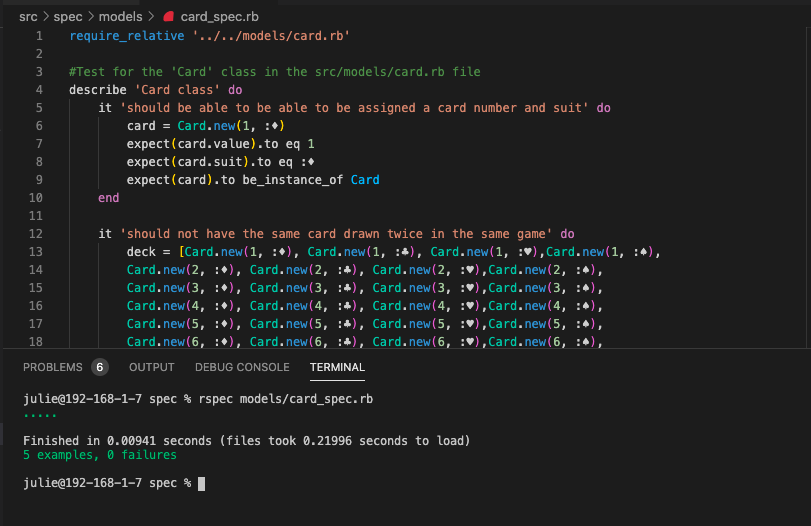

Screenshot of second test passing:
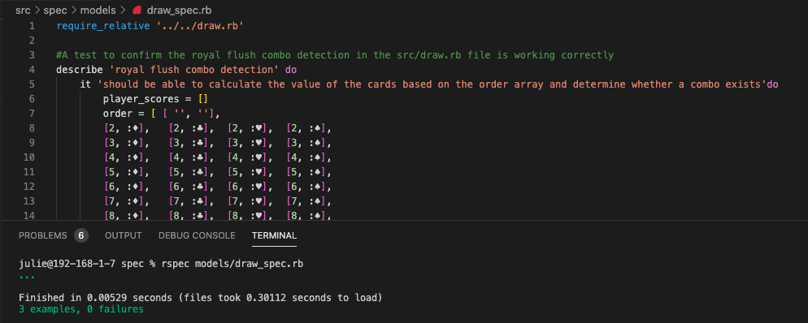

-------------------------
-------------------------
# References (R3)

* ASCII art generators:

    - Font Generator, https://fsymbols.com/generators/tarty/
    - Ascii-art Generator, https://www.ascii-art-generator.org/
    - Ascii Art Archive, https://www.asciiart.eu/weapons/knives

* Castello, J, 2020, How To Read & Write Files in Ruby, https://www.rubyguides.com/2015/05/working-with-files-ruby/
* Castello, J, 2020, How to Build Command-Line Applications (CLI) with Ruby, https://www.rubyguides.com/2018/12/ruby-argv/
* TTY-prompt Gem, https://rubygems.org/gems/tty-prompt
* Colorize Gem, https://rubygems.org/gems/colorize 
* Ruby2d Gem, https://rubygems.org/gems/ruby2d
* Artii Gem, https://rubygems.org/gems/artii
